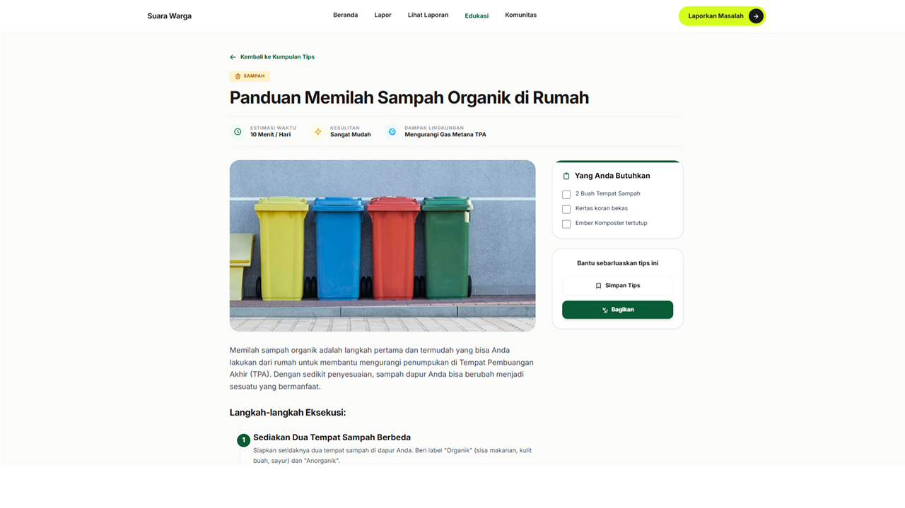

# Suara Warga - CROWDIT2026_Noctivus

"Dari Laporan Menjadi Perubahan."

## Overview
**Suara Warga** adalah platform digital berbasis website yang dirancang untuk meningkatkan kesadaran masyarakat terhadap berbagai permasalahan lingkungan. Platform ini hadir sebagai ruang transparan bagi masyarakat untuk melaporkan, memantau, mempelajari, serta berpartisipasi langsung dalam penyelesaian masalah lingkungan secara bersama-sama.

Saat ini, banyak permasalahan lingkungan seperti tumpukan sampah liar, selokan tersumbat, banjir, fasilitas umum yang rusak, hingga pencemaran lingkungan sering ditemukan di sekitar masyarakat. Namun, sebagian besar permasalahan tersebut hanya berakhir menjadi keluhan di media sosial atau grup percakapan tanpa adanya tindak lanjut yang jelas dan terorganisir. Masyarakat seringkali hanya menjadi penonton karena kurangnya wadah yang tepat dan terstruktur untuk bertindak dan menyampaikan aspirasi mereka.

Suara Warga hadir untuk menjembatani kesenjangan tersebut dengan menyediakan platform yang menggabungkan konsep social awareness, environmental education, civic engagement, dan visual transparency. Masyarakat tidak lagi hanya mengeluh, melainkan dapat menyampaikan laporan lingkungan secara cepat dan terorganisir dengan menyertakan bukti foto, lokasi, dan deskripsi. Setiap laporan yang masuk akan ditampilkan secara transparan agar warga lain dapat melihat perkembangan masalah, memberikan dukungan, dan memantau penyelesaiannya. Selain sebagai sistem pelaporan, platform ini juga proaktif memberikan sarana edukasi dan wadah aksi komunitas nyata untuk menumbuhkan budaya peduli lingkungan yang berkelanjutan.

## Fitur Utama
1. Environmental Reporting System: Sistem pelaporan masalah lingkungan yang memungkinkan masyarakat mengirim laporan lengkap dengan foto, lokasi, kategori masalah, dan deskripsi kondisi di lapangan secara transparan.
2. Environmental Education: Pusat informasi yang menyajikan artikel singkat, fakta lingkungan, dan tips interaktif mengenai isu lingkungan untuk meningkatkan pemahaman serta kesadaran masyarakat.
3. Community Action: Ruang partisipasi sosial bagi warga untuk menemukan dan bergabung langsung dalam kegiatan peduli lingkungan seperti kerja bakti, aksi bersih sungai, penanaman pohon, dan berbagai kegiatan sosial lainnya.

## Tujuan Proyek
* Meningkatkan kesadaran masyarakat terhadap kondisi lingkungan sekitar.
* Membantu masyarakat melaporkan masalah lingkungan secara terorganisir dan transparan.
* Memberikan edukasi mengenai pentingnya menjaga lingkungan dan dampak dari kerusakan lingkungan.
* Mendorong partisipasi aktif masyarakat dalam aksi sosial lingkungan.
* Menjadi media penghubung antara warga dan komunitas lingkungan.
* Membangun budaya peduli lingkungan melalui pemanfaatan teknologi digital.

## Target Pengguna
* Masyarakat umum
* Pelajar dan mahasiswa
* Komunitas peduli lingkungan
* Pengurus RT/RW atau organisasi lingkungan lokal

## Tim Pengembang
| Nama | Peran |
| :--- | :--- |
| Raihan Daffa | Full Stack Developer |
| Vio Aditya Syahputra | Full Stack Developer |

## Teknologi yang Digunakan
* HTML5 & CSS3
* Tailwind CSS
* Vanilla JavaScript

## Struktur Direktori
* `/assets/` - Direktori penyimpanan aset statis web seperti file konfigurasi CSS, font, ikon, gambar, dan JavaScript.
* `/dashboard/` - Direktori yang berisi halaman interaktif untuk memantau ringkasan statistik laporan lingkungan dan aktivitas dalam platform.
* `/edukasi/` - Direktori berisi halaman-halaman yang menyajikan konten edukasi lingkungan, artikel, tips, dan video pembelajaran.
* `/komunitas/` - Direktori halaman untuk menelusuri, melihat detail, dan berpartisipasi dalam acara atau aksi komunitas lingkungan (Community Action).
* `/report/` - Direktori inti dari sistem pelaporan yang berisi formulir pembuatan laporan warga hingga halaman detail status laporan.
* `index.html` - Halaman pendaratan utama (Landing Page) yang menyajikan rangkuman fitur, peta interaktif, dan navigasi utama aplikasi.

## Panduan Instalasi dan Penggunaan
1. Clone repository ini:
   ```bash
   git clone <url-repository>
   cd "Suara Warga"
   ```

2. Buka file `index.html` di browser pilihan Anda, atau gunakan ekstensi seperti **Live Server** di VS Code untuk pengalaman pengembangan yang lebih baik.

## Dokumentasi Tampilan Aplikasi

Berikut adalah dokumentasi visual dari platform **Suara Warga** yang dikelompokkan berdasarkan kategori modul fitur utama:

### Landing Page
Halaman perkenalan utama platform yang menyajikan informasi awal bagi warga mengenai pentingnya kesadaran lingkungan dan cara kerja platform.

<p align="center">
  
  
</p>

<p align="center">
  
  
</p>

* **Hero Section (Gambar 1)**: Tampilan pembuka yang menyajikan pesan ajakan *"Dari Laporan Menjadi Perubahan"* serta navigasi cepat menuju fitur pelaporan.
* **Fitur & Dampak Lingkungan (Gambar 2)**: Bagian yang menjelaskan tiga pilar layanan utama (Pelaporan, Edukasi, dan Komunitas) serta urgensi kepedulian lingkungan.
* **Alur Cara Kerja Platform (Gambar 3)**: Panduan langkah-langkah bagi masyarakat mulai dari membuat laporan, validasi laporan, hingga aksi penyelesaian.
* **Informasi Kontak & Footer (Gambar 4)**: Tautan cepat navigasi web, info media sosial, serta penutup halaman utama.

---

### Report (Sistem Pelaporan)
Modul utama untuk mempermudah warga dalam melaporkan isu lingkungan serta melihat transparansi status penanganannya secara terbuka.

<p align="center">
  
  
</p>

<p align="center">
  
</p>

* **Formulir Pelaporan Warga (Gambar 1)**: Antarmuka pengisian laporan terstruktur yang mewajibkan unggah bukti foto fisik, penentuan titik lokasi peta, kategori masalah, dan penjelasan detail kondisi lapangan.
* **Daftar Laporan Warga (Gambar 2)**: Dasbor sosial interaktif yang menampilkan daftar laporan masuk dari masyarakat sekitar agar sesama warga dapat saling mendukung (*upvote*) dan memantau perkembangannya.
* **Detail Laporan Warga (Gambar 3)**: Halaman rincian lengkap untuk tiap laporan yang mencakup status pengerjaan (Diterima, Diproses, Selesai), peta koordinat presisi, serta komentar dan riwayat perkembangan laporan.

---

### Edukasi (Environmental Education)
Pusat informasi dan media pembelajaran untuk meningkatkan kepedulian masyarakat terhadap masalah lingkungan di kehidupan sehari-hari.

<p align="center">
  
  
</p>

<p align="center">
  
</p>

* **Edukasi Artikel (Gambar 1)**: Kumpulan artikel menarik dan fakta-fakta singkat seputar ancaman pencemaran lingkungan untuk mengedukasi warga.
* **Video Edukasi (Gambar 2)**: Media pembelajaran berbasis audio-visual berupa video interaktif yang memudahkan penyampaian pesan ekologis.
* **Tips Peduli Lingkungan (Gambar 3)**: Panduan praktis berisi tips dan kebiasaan baik sederhana sehari-hari yang dapat dilakukan warga secara mandiri untuk menjaga bumi.

---

### Komunitas (Community Action)
Wadah interaksi dan kolaborasi nyata antara masyarakat dan komunitas lingkungan setempat.

<p align="center">
  
</p>

* **Aksi Komunitas (Gambar 1)**: Halaman yang berisi agenda kegiatan sosial lingkungan (seperti kerja bakti gotong royong, aksi bersih sungai, dan penanaman pohon) di mana warga dapat berpartisipasi langsung menjadi relawan.


## Ketentuan Penggunaan / Hak Cipta

Proyek **Suara Warga** ini merupakan hasil karya asli dari **Raihan Daffa** dan **Vio Aditya Syahputra**. 

* **Dilarang Menyalin**: Mohon untuk tidak menyalin (*clone/copy*), menduplikasi, memodifikasi, atau membagikan ulang kode program, aset, maupun desain UI proyek ini untuk kebutuhan tugas atau proyek pribadi Anda tanpa izin dari kami.
* **Tujuan**: Repositori ini dipublikasikan khusus untuk kepentingan keikutsertaan lomba serta sebagai proyek/portofolio pribadi kami.
